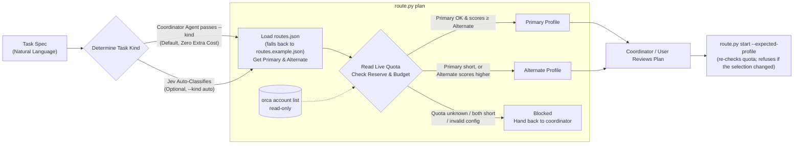

# Orca Model Routing

[English](README.md) | [中文版](README_zh.md)

An open-source **Agent Skill** for [Orca](https://github.com/stablyai/orca) that routes each task to one worker profile, choosing between the task's configured primary and alternate profiles based on live Orca account quota.

Orca is a local multi-agent orchestration host: it manages Claude / Codex / other agent accounts, creates orchestration Runs, and starts supervised workers (`orca orchestration worker-start`). This skill sits in front of that call and decides *which* profile to start.



> A quota-based alternate is an **initial selection**, not a retry after failure. The scripts never retry, switch accounts, or launch anything during `plan`.

---

## Quick Start

### Mode 1: Ask an Agent (Recommended)

Copy and send this prompt to your AI Agent:

```text
Please help me install and configure the Orca Model Routing Skill:
1. If not already cloned, clone the repository: `git clone https://github.com/yuanCodeLab/orca-model-routing-skill.git` and enter the directory.
2. Inspect `SKILL.md`, `README.md`, and `routes.example.json`.
3. Guide me to create a local `routes.json` with my real model IDs, task mappings, reserves, and quota budgets (the example values are placeholders).
4. Verify that `orca` is on PATH and signed in, then run a test plan: `python3 scripts/route.py plan --kind feature --complexity normal`, and explain the output to me.
```

---

### Mode 2: Manual Setup

1. **Clone Repository**:
   ```sh
   git clone https://github.com/yuanCodeLab/orca-model-routing-skill.git
   cd orca-model-routing-skill
   ```
   *(Or copy/link this folder into your host's skills directory, e.g. `~/.claude/skills/orca-model-routing`)*

2. **Configure Routes**: Copy the template and replace every placeholder (see [Configuration Reference](#configuration-reference)):
   ```sh
   cp routes.example.json routes.json
   ```
   `routes.json` is Git-ignored. If it is absent, the scripts load `routes.example.json`, whose model IDs (`replace-with-model-id-a`) are placeholders and are **not** a recommendation.

3. **Review a Plan** (never launches a worker):
   ```sh
   python3 scripts/route.py plan --kind feature --complexity normal --spec-file /path/to/task.txt
   ```
   `--kind` is required. `--spec-file` is optional for `plan` unless you use `--kind auto`.

4. **Start a Worker** (after plan review). You need an existing Orca Run; the script never creates one:
   ```sh
   orca orchestration run-create --objective "Fix login validation" --json   # note the Run ID
   python3 scripts/route.py start --run <RUN_ID> --kind feature --complexity normal \
     --spec-file /path/to/task.txt --expected-profile <PROFILE_FROM_PLAN>
   ```
   `start` re-reads quota. If the fresh selection differs from `--expected-profile`, it refuses to launch (exit code `3`) so the coordinator can review again.

---

## How to Use This Skill

This Skill supports two usage modes: **Auto Mode (Recommended)** and **Manual Mode**.

### 1. Auto Mode (Recommended, Zero-Prompt)

The skill is never executed on its own: agents only see its name and description, and invoke it when a request matches. A dispatch rule in your agent's instruction file tells the coordinator to use it for every worker dispatch, so you do not need the prompt template each time. Agents follow such rules reliably but not with a hard guarantee; nothing intercepts sessions in the background.

> **Prerequisite**: make the skill discoverable by each agent you use. Each agent reads its own skills directory:
> ```sh
> ln -s /path/to/orca-model-routing-skill ~/.agents/skills/orca-model-routing   # Agent Skills standard
> ln -s /path/to/orca-model-routing-skill ~/.claude/skills/orca-model-routing   # Claude Code
> ln -s /path/to/orca-model-routing-skill ~/.codex/skills/orca-model-routing    # Codex
> ```
> Check with `orca skills installed`: the entry should list the providers you linked.

Add the rule below to **one** of:
1. **Agent global instruction file** (applies to every session of that agent): `~/.claude/CLAUDE.md` for Claude Code, `~/.codex/AGENTS.md` for Codex.
2. **Project-level rule file** (applies to one repository): `AGENTS.md` or `CLAUDE.md` in the project root.

Orca itself has no global rules setting for this (checked in Orca 1.4.219); the rule lives in the agent's own instruction files.

**Dispatch Rule Template** (replace `<skill-dir>` with the absolute install path):
```markdown
[Worker Dispatch Policy]
When coordinating in Orca and dispatching a worker, use orca-model-routing:
1. Write the task and observable acceptance criteria to a spec file; decide the task kind (feature/bugfix/review/architecture/complex/bounded/mechanical/browser) and complexity (normal/hard).
2. Run `python3 <skill-dir>/scripts/route.py plan --kind <kind> --complexity <complexity> --spec-file <spec-file>` and report the selected profile and quota.
3. After approval, run `python3 <skill-dir>/scripts/route.py start --run <RUN_ID> --kind <kind> --complexity <complexity> --spec-file <spec-file> --expected-profile <profile>`.
4. On exit code 2 (blocked) or 3 (selection changed), stop and ask; do not pick a model or retry on your own.
Do not bypass the quota check by dispatching with default models. This applies only to Orca worker dispatch, not to ordinary chats.
```

---

### 2. Manual Mode (One-Off Prompt)

If global rules are not configured, or if you prefer explicit control for a specific task, copy and send this prompt to your coordinator Agent:

```text
I have a development task to execute:
[Task Description]: [Describe your task here, e.g. Fix phone number format validation on the login page and add unit tests]

Please route this task using orca-model-routing in `[your-actual-install-path]`:
1. Write the task description and observable acceptance criteria into a spec file.
2. Analyze the task kind (e.g. feature/bugfix/review) and complexity (normal/hard).
3. Run `python3 <actual-path>/scripts/route.py plan --kind <kind> --complexity <complexity> --spec-file <spec-file>` to check live quota and generate a routing plan.
4. Show me the plan: live quota windows, the selected profile, and any blocked reason. If it is blocked (exit code 2), stop and ask me; do not pick a model yourself.
5. After I approve, use the current Orca Run (or create one with `orca orchestration run-create`), then run
   `python3 <actual-path>/scripts/route.py start --run <RUN_ID> --kind <kind> --complexity <complexity> --spec-file <spec-file> --expected-profile <profile-from-plan>`.
   If it exits with code 3 (selection changed), show me the new plan instead of retrying.
6. Verify the worker's completion through Orca's lifecycle tools; a successful start alone is not completion.
```

---

## Reading the Plan Output

`plan` prints JSON. The fields that matter most:

| Field | Meaning |
| :--- | :--- |
| `launchable` | `true` if a profile was selected and `start` would launch it |
| `plan.profile` / `plan.model` | Selected profile, or `null` when blocked |
| `plan.selection_reason` | Why this profile won (score comparison, primary short, etc.) |
| `blocked_reason` / `plan.blocked_code` | Why nothing was selected (see below) |
| `quota.candidates[].windows` | Per-window remaining, reserve, available, budget, minutes to reset |
| `explain` | Plain-text description of the scoring rules |

| `blocked_code` | Meaning |
| :--- | :--- |
| `quota_unknown` | Quota could not be verified (query failed, stale, malformed, window mismatch). Not treated as 0 or 100 |
| `quota_insufficient` | Verified available quota is below the task budget for every usable candidate |
| `capability_unconfirmed` | The alternate is eligible but its required tools/account capability is not confirmed |
| `no_candidate` | Profile disabled or has no model ID |
| `policy_invalid` | `quota_policy` in your config is invalid |
| `effort_unsupported` | `--effort` passed to a profile whose effort is embedded in the model ID |

| Exit code | Meaning |
| :--- | :--- |
| `0` | Plan launchable / worker start returned success |
| `2` | Blocked, invalid arguments, or Jev needs the coordinator |
| `3` | `start` only: fresh quota changed the selection vs. `--expected-profile` |

> Script messages (`reasons`, `explain`, errors) are currently in **Chinese**.

**Common case:** `quota_unknown` with `额度数据过期` means Orca's cached quota is older than `stale_after_seconds`. Open Orca so it refreshes account usage, then re-run `plan`.

---

## Configuration Reference

All settings live in `routes.json` (or the example template). They are reread on every invocation.

| Key | Purpose |
| :--- | :--- |
| `models.<profile>` | `agent` (Orca agent: `codex`, `claude`, …), `model` (model ID), `effort` / `hard_effort` (reasoning effort for normal / hard tasks; omit both when effort is embedded in the model ID), `enabled` |
| `tasks.<kind>` | `primary` and `alternate` profile names, `effort`, `description` (used as the worker task title), optional `read_only: true` (worker told not to edit files) |
| `tasks.<kind>.alternate_capability_confirmed` | Set `false` when the alternate has not been verified to have the tools the task needs (e.g. browser). It then can never be auto-selected |
| `explicit_overrides.allowed_efforts` | Values accepted by `--effort` |
| `quota_policy.reserves` | Per-agent reserve in percentage points for the coordinator's own use over one full window, e.g. `{"claude": {"session": 20, "weekly": 10}}`. Workers never dispatch into the effective reserve |
| `quota_policy.reserve_scaling` | `prorated` (default): effective reserve = configured reserve × minutes to reset ÷ window minutes, so it shrinks as the reset approaches and quota is not locked up just before it resets. `fixed`: always deduct the full configured reserve |
| `quota_policy.task_budget_points` | Minimum available points per window a candidate needs for `normal` / `hard` tasks. Overridable with `--budget-session` / `--budget-weekly` |
| `quota_policy.capacity_factors` | Relative weight per agent for scoring. Illustrative only, not measured token capacity |
| `quota_policy.windows` | Expected window length, time floor, and weight for `session` and `weekly` |
| `quota_policy.unknown_policy.primary_without_reserve` | `block` (default) or `allow`: whether an unknown-quota primary without a reserve may still launch |
| `quota_policy.stale_after_seconds` | Quota data older than this is treated as unknown |
| `jev` | Optional auto-classification; see below |

**Tip:** Put a task's primary and alternate in **different account pools** (different `agent`). Two profiles in the same pool read the same quota, so the comparison always keeps the primary, and when the primary is short the alternate is short too; quota switching never takes effect.

Example values (budgets, factors, weights) are illustrative and not calibrated recommendations.

---

## Choosing Models per Task (Reference)

The template ships with placeholder profiles. To pick real models for each task kind, the author used two public leaderboards. Rankings change often, so re-check them before updating your `routes.json`.

### Sources and the Dimensions Used

**[Artificial Analysis](https://artificialanalysis.ai/leaderboards/models)**: benchmark-based, reported **per reasoning effort** (low / medium / high / xhigh / max)

| Dimension | What it tells you | Used for |
| :--- | :--- | :--- |
| Intelligence Index | Composite of ~10 evals (Terminal-Bench, SciCode, GDPval, Humanity's Last Exam, …) | Capability at the **exact effort level** you configure; scores drop sharply at lower effort for some models |
| Price (blended $/1M tokens) | Relative cost per token | Spotting dominated options (same score, several times the cost) |
| Output speed (tokens/s) | Latency | Favoring fast models for mechanical or browser tasks |
| Coding Agent Index | Model + harness on DeepSWE, Terminal-Bench, SWE-Atlas | Most relevant, but behind a paywall at the time of writing; not used |

**[Arena](https://arena.ai/leaderboard)**: human-preference and real-session data, mostly at high/max effort

| Leaderboard / dimension | What it tells you | Used for |
| :--- | :--- | :--- |
| [Agent](https://arena.ai/leaderboard/agent): Net Improvement | Overall gain over baseline in real agentic sessions | Overall agent strength |
| Agent: Cost per task, Output tokens | Real spend and verbosity per task | Estimating quota burn (e.g. very verbose models drain quota fast) |
| Agent: Confirmed Success | User-confirmed task completion | Implementing from a clear spec (feature, bounded) |
| Agent: Bash Recovery | Recovering after command errors | Debugging and bug fixing (bugfix, complex) |
| Agent: Steerability | Accepting user corrections | Long interactive tasks, browser flows |
| Agent: Tool Hallucination | Inventing tools that do not exist | Reliability of tool-heavy tasks |
| Agent: Praise vs Complaint | Ratio of positive to negative user reactions | Tie-breaker |
| [WebDev](https://arena.ai/leaderboard/code/webdev) Elo | Preference for generated web apps | Front-end feature work |
| [Text → Coding](https://arena.ai/leaderboard/text/coding) Elo | Chat-style coding preference | Weak signal; top models sit within each other's confidence intervals |

### What Each Task Kind Needs

| Task kind | Key dimensions | Guidance |
| :--- | :--- | :--- |
| `feature` | Confirmed Success, cost per task | A cost-efficient model at medium effort; alternate at a comparable score level |
| `bugfix` | Bash Recovery, Intelligence at the chosen effort | A model that recovers well from failing commands; avoid low effort |
| `review` (read-only) | Intelligence, Praise vs Complaint | A strong model at medium/high effort, preferably a different family from the implementer |
| `architecture` (read-only) | Intelligence at high effort | Low-volume, high-value; spend effort here |
| `complex` | Net Improvement, Bash Recovery, Intelligence at high effort | Your strongest agent model at high effort; do not start at low |
| `bounded` | Intelligence vs. price | A cheap but capable tier; very small models fail logic and cost more in retries |
| `mechanical` | Speed, price | The fastest, cheapest model is fine |
| `browser` | Steerability, Bash Recovery, Tool Hallucination, speed | Verify tool access first; weak agent models suit only simple page checks |

### Example Pairing (snapshot, 2026-10)

Illustration only, from the author's setup. Use your own available models and re-check the leaderboards.

Updated 2026-10-08 for Claude Haiku 5.5 (`claude-haiku-5-5`, released that day): Artificial Analysis ranks it the top small model (Intelligence Index 43 at max, 41 at xhigh). It is used only as a Claude-pool alternate for `bounded`, `mechanical`, and `browser`. With Terminal-Bench 4.0 at 39.2% vs Sonnet 5.5's 70.6%, it is not used for feature, bugfix, review, architecture, or complex work. Arena had no data for it yet.

| Task | Primary | Alternate | Main reason |
| :--- | :--- | :--- | :--- |
| feature | GPT-6.1 Sol (medium) | Claude Sonnet 5.5 (high) | Sol: best intelligence per dollar and highest Confirmed Success |
| bugfix | Claude Sonnet 5.5 (high) | GPT-6.1 Sol (medium) | Sonnet Bash Recovery 15.1 vs Sol 3.5; Sonnet drops sharply at medium (AA 41) |
| review | Claude Opus 5.5 (medium) | GPT-6.1 Sol (high) | Opus medium (AA 51) beats Sonnet high (47) at similar cost |
| architecture | Claude Opus 5.5 (high) | GPT-6.1 Sol (xhigh) | Opus high: Arena Agent #2 at $1.56/task |
| complex | Claude Opus 5.5 (high) | GPT-6 Astra (high) | Opus high outranks Astra max at half the cost; Astra Bash Recovery 5.3 |
| bounded | GPT-6.1 Sol (low) | Claude Haiku 5.5 (xhigh) | Luna's Confirmed Success ≈ 0 in Arena Agent, so too weak for logic; Haiku xhigh matches Sonnet medium (AA 41) at ~1/4 the price |
| mechanical | GPT-6 Luna (low) | Claude Haiku 5.5 (medium) | Fast (~130 t/s) and nearly free; Haiku is the cheapest Claude-pool option |
| browser | Gemini 3.8 Flash High | Claude Haiku 5.5 (xhigh, capability unconfirmed) | Fastest available Gemini; weak agent signals, so simple checks only. Haiku 5.5 scores 72.4% on OSWorld (computer use) |

**Capacity factors used with this pairing:** `"capacity_factors": {"codex": 1, "claude": 1.5, "antigravity": 3}`

In the author's experience, the same 1% of Claude subscription quota lasts longer than 1% of Codex quota, so Claude is weighted 1.5×. This comes from day-to-day use and has **not been measured**; neither vendor publishes how many tokens 1% represents. The template keeps every factor at `1`.

Because every pair crosses pools, this factor affects every task. Combined with a Claude reserve of session 20 / weekly 10 (prorated), the effect for `feature` (primary Sol / alternate Sonnet) when both pools show the same usage, with about 2 hours left in the session window and 2 days in the weekly window, is:

| `claude` factor | Primary (Codex) wins once both pools have used at least |
| :--- | :--- |
| 1 | 0% (always, at equal usage) |
| 1.2 | ~70% |
| **1.5** | **~85%** |
| 2 | ~89% |

So with `1.5`, Claude alternates take most tasks until Claude is nearly used up, and Codex primaries take over only near the reserve line. The closer the resets, the smaller the prorated reserve and the stronger this tilt. With a `fixed` reserve the thresholds are lower (1.2 → ~15%, 1.5 → ~57%, 2 → ~71%). If the Claude pool keeps running out before Codex, or the coordinator is often blocked by the reserve, lower the factor.

To calibrate: record each pool's `usedPercent` (from `orca account list --json`) before and after tasks, average the points consumed per task kind, and set the factor ≈ Codex points per task ÷ Claude points per task. Usage is reported in whole percent, so average over at least ten or so tasks, run one at a time, preferably on the 5-hour session window.

Caveats: Arena mostly measures high/max effort, so low/medium choices rely on Artificial Analysis. Neither source states which harness (Codex CLI, Claude Code, …) produced the results. Top-5 differences in Arena Agent overlap within confidence intervals. API prices are only a proxy for subscription quota. The most reliable calibration is your own success rate and quota use per task.

---

## How to Reload an Updated Skill

If you modified the code or local configuration (e.g. updated `routes.json` or `SKILL.md`), use one of the following methods to ensure your Agent picks up the latest version:

1. **Start a New Session / Run (Recommended)**:
   Most host applications rescan and index local Skills upon starting a new session.
2. **Prompt the Agent in Current Session (No Restart)**:
   Send this prompt to your running Agent without exiting (replace the bracketed placeholder with your actual local path):
   > "The skill in `[your-actual-install-path]` has been updated. Please reread `SKILL.md` in that directory and use `python3 scripts/route.py` from that path for routing."
3. **Restart the Host Application**:
   If the host caches skill metadata in a daemon or desktop process, fully restart the host application.
4. **Run Directly in Terminal (Instant)**:
   The scripts reread `routes.json` on every execution, so `python3 scripts/route.py plan --kind feature --complexity normal` always reflects the latest configuration.

---

## Prerequisites & Optional Setup

| Item | Requirement | Notes |
| :--- | :--- | :--- |
| **Python** | 3.10+ | Uses standard library only |
| **Orca CLI** | Required | Must be on `PATH` and signed in for quota reads and worker starts |
| **Jev (Optional)** | TypeSafe API Key | Classifies task kind and complexity (`--kind auto`); requires a dedicated API key, incurs API costs, and sends the task spec to TypeSafe, so disabled by default. See below to enable |

### Enable Jev (Optional)

> **When to Enable?**
> - **Not Needed (Recommended)**: Interactive development or orchestration by a coordinator Agent. The main Agent can already classify whether a task is a `feature` or `bugfix` and pass `--kind <type>` directly, avoiding extra API keys, costs, latency, and sending task text to a third party.
> - **Recommended**: Headless, unattended automation pipelines (e.g. batch-processing raw tickets from GitHub Issues or Jira without an interactive coordinator Agent).

> **Privacy:** With `--kind auto`, the **full task spec text** (up to 16,000 characters) is sent to `api.typesafe.ai`. Do not enable it for specs containing code or data you may not share with a third party.

#### Option 1: Ask an Agent (Recommended)

Copy and send this prompt to your AI Agent:

```text
Please help me enable and configure Jev automatic task classification:
1. Ask me to run `python3 scripts/setup_jev.py` myself in an interactive terminal to configure my TypeSafe API Key (the key is entered in the terminal with hidden input, never shared in chat).
2. Set `"enabled": true` under `"jev"` in my local `routes.json`.
3. Test automatic classification by running `python3 scripts/route.py plan --kind auto --spec-file <task-file>`.
```

#### Option 2: Manual Setup

1. **Configure API Key** (hidden interactive prompt; verified against TypeSafe's model list, no inference call):
   ```sh
   python3 scripts/setup_jev.py          # save a key
   python3 scripts/setup_jev.py --check  # re-verify the saved key
   ```
   The key is stored at `~/.config/orca-model-routing/jev-credentials.json` (mode `0600`; honors `XDG_CONFIG_HOME`), never in the repository.
2. **Enable in `routes.json`**: Set `"enabled": true` under `"jev"`:
   ```json
   "jev": { "enabled": true, "model": "jev-latest", "min_confidence": 0.5 }
   ```
3. **Test Automatic Route**:
   ```sh
   python3 scripts/route.py plan --kind auto --spec-file /path/to/task.txt
   ```

If Jev's confidence is below `min_confidence`, or it answers `unmatched` (unclear or multiple independent tasks), the plan exits with code `2` and hands the decision back to the coordinator. Jev only chooses among task kinds defined in your config.

---

## Privacy & Security

- **No Background Daemon**: Runs only when invoked; does not intercept normal chats.
- **Local Credentials**: Never commit API keys, token caches, or `routes.json` (ignored by Git).
- **Quota Privacy**: Quota is read with `orca account list --json` (read-only) and reduced to status, timestamps, and usage numbers; account identities and raw receipts are never stored or printed.
- **Third-Party Calls**: Only with Jev enabled and `--kind auto` is task text sent outside your machine (to TypeSafe). Without Jev, nothing leaves your machine except what Orca itself does.

## License

[MIT](LICENSE)
