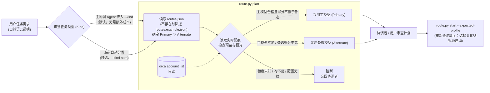

# Orca Model Routing

[English](README.md) | [中文版](README_zh.md)

这是一个面向 [Orca](https://github.com/stablyai/orca) 的开源 **Agent Skill**：为每个任务选定一个 worker 档位，并根据 Orca 账户的实时配额，在该任务配置的首选（Primary）与备选（Alternate）档位之间做选择。

Orca 是本地多 Agent 编排宿主：管理 Claude / Codex 等 Agent 账户、创建编排 Run、启动受监管的 worker（`orca orchestration worker-start`）。本 Skill 位于这一调用之前，负责决定**启动哪个**档位。



> 基于额度选中备选只是**首次选择**，不是失败后的重试。脚本不会自动重试、切换账号；`plan` 阶段不会启动任何东西。

---

## 快速上手

### 模式一：让 Agent 自动配置（推荐）

直接复制以下提示词发送给你的 AI Agent：

```text
请帮我安装并配置 Orca Model Routing Skill：
1. 如果本地尚未克隆该项目，请先执行：`git clone https://github.com/yuanCodeLab/orca-model-routing-skill.git` 并进入该目录。
2. 查看项目下的 `SKILL.md`、`README_zh.md` 和 `routes.example.json`。
3. 指导我创建本地 `routes.json`，填入我真实的模型 ID、任务类型映射、预留与配额预算（示例值均为占位符）。
4. 检查本机 `orca` 是否在 PATH 中且已登录，然后运行一次测试计划：`python3 scripts/route.py plan --kind feature --complexity normal`，并向我解释输出结果。
```

---

### 模式二：手动安装配置

1. **克隆代码到本地**：
   ```sh
   git clone https://github.com/yuanCodeLab/orca-model-routing-skill.git
   cd orca-model-routing-skill
   ```
   *(或将此目录复制/软链到宿主应用的 Skills 目录，例如 `~/.claude/skills/orca-model-routing`)*

2. **配置路由规则**：复制示例配置并替换所有占位值（字段说明见[配置说明](#配置说明)）：
   ```sh
   cp routes.example.json routes.json
   ```
   `routes.json` 已被 Git 忽略。若该文件不存在，脚本会读取 `routes.example.json`，其中的模型 ID（如 `replace-with-model-id-a`）只是占位符，**不是**推荐配置。

3. **查看路由计划**（不会启动 worker）：
   ```sh
   python3 scripts/route.py plan --kind feature --complexity normal --spec-file /path/to/task.txt
   ```
   `--kind` 为必填。使用显式 kind 时 `plan` 可不带 `--spec-file`；`--kind auto` 时必须带。

4. **启动 Worker**（审查计划后执行）。需要一个已存在的 Orca Run，脚本不会自动创建：
   ```sh
   orca orchestration run-create --objective "修复登录校验" --json   # 记下 Run ID
   python3 scripts/route.py start --run <RUN_ID> --kind feature --complexity normal \
     --spec-file /path/to/task.txt --expected-profile <计划中选定的档位>
   ```
   `start` 会重新查询额度。若最新选择与 `--expected-profile` 不同，则拒绝启动（退出码 `3`），交由协调者重新审查。

---

## 如何使用本 Skill

本 Skill 支持两种使用方式：**自动模式（优先推荐）** 和 **手动模式**。

### 1. 自动模式（优先推荐，免手动提示词）

Skill 不会自己运行：Agent 只能看到它的名称和描述，判断请求匹配时才会调用。在 Agent 的指令文件里加一条派发规则，协调者每次派发 worker 时就会优先使用它，无需每次重复输入提示词。Agent 通常会遵守这类规则，但不是硬性保证；也没有任何后台进程拦截会话。

> **前提**：让你使用的每个 Agent 都能发现本 Skill。各 Agent 读取各自的技能目录：
> ```sh
> ln -s /path/to/orca-model-routing-skill ~/.agents/skills/orca-model-routing   # Agent Skills 通用目录
> ln -s /path/to/orca-model-routing-skill ~/.claude/skills/orca-model-routing   # Claude Code
> ln -s /path/to/orca-model-routing-skill ~/.codex/skills/orca-model-routing    # Codex
> ```
> 可用 `orca skills installed` 检查：对应条目应列出你链接过的 Agent。

把下方规则写入以下**其中一处**：
1. **Agent 全局指令文件**（对该 Agent 的所有会话生效）：Claude Code 写入 `~/.claude/CLAUDE.md`，Codex 写入 `~/.codex/AGENTS.md`。
2. **项目级规则文件**（只对单个仓库生效）：项目根目录的 `AGENTS.md` 或 `CLAUDE.md`。

Orca 本身没有用于此的全局规则设置（已在 Orca 1.4.219 中核实），规则需写在 Agent 自己的指令文件里。

**可直接复制的调度规则模板**（把 `<skill-dir>` 换成 Skill 的绝对安装路径）：
```markdown
[Worker 派发策略]
在 Orca 中协调并派发 worker 时，使用 orca-model-routing：
1. 把任务内容与可观察的验收条件写入任务说明文件；判断任务类型（feature/bugfix/review/architecture/complex/bounded/mechanical/browser）与复杂度（normal/hard）。
2. 执行 `python3 <skill-dir>/scripts/route.py plan --kind <类型> --complexity <复杂度> --spec-file <任务说明文件>`，汇报选中的档位与额度情况。
3. 经确认后执行 `python3 <skill-dir>/scripts/route.py start --run <RUN_ID> --kind <类型> --complexity <复杂度> --spec-file <任务说明文件> --expected-profile <档位>`。
4. 退出码为 2（被阻断）或 3（选择已变化）时停下来询问，不要自行换模型或重试。
不得绕过额度检查直接用默认模型派发。本规则只适用于 Orca 中派发 worker，不影响普通对话。
```

---

### 2. 手动模式（用手动提示词）

若未配置全局规则，或希望在单次会话中显式控制调度，直接复制以下提示词发送给你的主 Agent：

```text
我有一个开发任务需要处理：
【任务内容】：[在这里填写你的具体需求，例如：修复登录页面的手机号格式校验逻辑，补充单元测试]

请使用 `[Skill实际安装路径]` 下的 orca-model-routing 进行配额感知路由：
1. 把任务内容和可观察的验收条件写入一个任务说明文件（spec file）。
2. 分析该任务的类型（如 feature/bugfix/review）与复杂度（normal/hard）。
3. 执行 `python3 <Skill实际路径>/scripts/route.py plan --kind <任务类型> --complexity <复杂度> --spec-file <任务说明文件>` 检查实时额度并生成计划。
4. 向我汇报该计划：各模型额度窗口、被选中的档位，以及阻断原因（如有）。若被阻断（退出码 2），停下来问我，不要自行换模型。
5. 经我确认后，使用当前的 Orca Run（或用 `orca orchestration run-create` 新建），执行
   `python3 <Skill实际路径>/scripts/route.py start --run <RUN_ID> --kind <任务类型> --complexity <复杂度> --spec-file <任务说明文件> --expected-profile <计划中的档位>`。
   若退出码为 3（选择已变化），把新计划给我看，不要自行重试。
6. 通过 Orca 的生命周期工具确认 worker 实际完成；启动成功不等于任务完成。
```

---

## 如何解读 plan 输出

`plan` 输出 JSON，最关键的字段：

| 字段 | 含义 |
| :--- | :--- |
| `launchable` | `true` 表示已选定档位，`start` 会启动它 |
| `plan.profile` / `plan.model` | 选中的档位；被阻断时为 `null` |
| `plan.selection_reason` | 选择理由（分数对比、主选不足等） |
| `blocked_reason` / `plan.blocked_code` | 未选中任何档位的原因（见下表） |
| `quota.candidates[].windows` | 各窗口的剩余、预留、可派发、预算、距重置分钟 |
| `explain` | 打分规则的文字说明 |

| `blocked_code` | 含义 |
| :--- | :--- |
| `quota_unknown` | 额度无法校验（查询失败、过期、格式异常、窗口不符），不会当作 0 或 100 |
| `quota_insufficient` | 已校验的可派发额度低于任务预算，且没有可用备选 |
| `capability_unconfirmed` | 备选额度合格，但所需工具/账户能力未确认 |
| `no_candidate` | 档位已禁用或未填模型 ID |
| `policy_invalid` | 配置中的 `quota_policy` 无效 |
| `effort_unsupported` | 对推理强度已内嵌在模型 ID 的档位传了 `--effort` |

| 退出码 | 含义 |
| :--- | :--- |
| `0` | 计划可启动 / worker 启动成功 |
| `2` | 被阻断、参数无效，或 Jev 分类需交回协调者 |
| `3` | 仅 `start`：最新额度使选择与 `--expected-profile` 不一致 |

**常见情况**：`quota_unknown` 且原因含"额度数据过期"，说明 Orca 缓存的额度数据超过了 `stale_after_seconds`。打开 Orca 让它刷新账户用量后，重新运行 `plan` 即可。

---

## 配置说明

所有设置都在 `routes.json`（或示例模板）中，每次调用都会重新读取。

| 字段 | 作用 |
| :--- | :--- |
| `models.<档位>` | `agent`（Orca Agent：`codex`、`claude` 等）、`model`（模型 ID）、`effort` / `hard_effort`（normal / hard 任务的推理强度；推理强度已内嵌在模型 ID 时两者都省略）、`enabled` |
| `tasks.<类型>` | `primary` 与 `alternate` 档位名、`effort`、`description`（用作 worker 任务标题）、可选 `read_only: true`（要求 worker 不修改文件） |
| `tasks.<类型>.alternate_capability_confirmed` | 备选尚未验证具备任务所需工具（如浏览器）时设为 `false`，此时备选永远不会被自动选用 |
| `explicit_overrides.allowed_efforts` | `--effort` 允许的取值 |
| `quota_policy.reserves` | 按 Agent 设置的硬性预留（百分点），如 `{"claude": {"session": 20, "weekly": 30}}`；即使快重置也不会动用 |
| `quota_policy.task_budget_points` | normal / hard 任务在每个窗口至少需要的可派发点数；可用 `--budget-session` / `--budget-weekly` 单次覆盖 |
| `quota_policy.capacity_factors` | 各 Agent 的打分相对权重；仅为示例，不是实测 token 容量 |
| `quota_policy.windows` | `session` 与 `weekly` 窗口的预期长度、时间下限和权重 |
| `quota_policy.unknown_policy.primary_without_reserve` | `block`（默认）或 `allow`：无预留的主选额度未知时是否仍可启动 |
| `quota_policy.stale_after_seconds` | 超过该秒数的额度数据视为未知 |
| `jev` | 可选的自动分类，见下文 |

**建议**：主选与备选尽量放在**不同的账户池**（不同 `agent`）。同一账户池的两个档位读取的是同一份额度，比较结果永远是主选，主选不足时备选也必然不足，额度切换不会生效。

示例中的预算、权重等数值仅作示意，并非经过校准的推荐值。

---

## 按任务选模型参考

模板里只有占位档位。为各任务类型挑选真实模型时，作者参考了两个公开排行榜。排名变化很快，更新 `routes.json` 前请重新查看。

### 数据来源与参考维度

**[Artificial Analysis](https://artificialanalysis.ai/leaderboards/models)**：基于基准测试，**按推理档位分别给分**（low / medium / high / xhigh / max）

| 维度 | 含义 | 用途 |
| :--- | :--- | :--- |
| Intelligence Index（智能指数） | 约 10 项评测的综合分（Terminal-Bench、SciCode、GDPval、Humanity's Last Exam 等） | 判断你**实际配置档位**下的能力；部分模型降档后分数下滑明显 |
| 价格（混合 $/1M tokens） | 每 token 相对成本 | 识别"分数相同、价格高出数倍"的劣势选项 |
| 输出速度（tokens/s） | 响应快慢 | mechanical、browser 等任务优先选快的 |
| Coding Agent Index | 模型 + 工具链在 DeepSWE、Terminal-Bench、SWE-Atlas 上的表现 | 最相关，但撰写时需付费才能查看，未采用 |

**[Arena](https://arena.ai/leaderboard)**：基于真人偏好与真实会话，主要覆盖 high/max 档

| 榜单 / 维度 | 含义 | 用途 |
| :--- | :--- | :--- |
| [Agent](https://arena.ai/leaderboard/agent)：Net Improvement | 真实 agent 会话中相对基线的综合提升 | 总体 agent 能力 |
| Agent：每任务成本、输出 token | 每个任务的真实花费与啰嗦程度 | 估算额度消耗（输出很长的模型耗额度很快） |
| Agent：Confirmed Success | 用户确认任务完成的比例 | 按明确说明实现功能（feature、bounded） |
| Agent：Bash Recovery | 命令出错后自行恢复的能力 | 调试与修 bug（bugfix、complex） |
| Agent：Steerability | 被用户纠正后能否听进去 | 长交互任务、浏览器流程 |
| Agent：Tool Hallucination | 编造不存在工具的比例 | 重度依赖工具任务的可靠性 |
| Agent：Praise vs Complaint | 用户正面与负面反馈的比例 | 难分高下时参考 |
| [WebDev](https://arena.ai/leaderboard/code/webdev) Elo | 对生成网页应用的偏好 | 前端类 feature |
| [Text → Coding](https://arena.ai/leaderboard/text/coding) Elo | 对话式写代码的偏好 | 区分度低，头部模型都在彼此置信区间内 |

### 各任务类型看重什么

| 任务类型 | 关键维度 | 选型思路 |
| :--- | :--- | :--- |
| `feature` | Confirmed Success、每任务成本 | 性价比高的模型用 medium；备选选分数相近的档位 |
| `bugfix` | Bash Recovery、所选档位的智能指数 | 选出错后恢复能力强的模型，避免低档位 |
| `review`（只读） | 智能指数、Praise vs Complaint | 强模型用 medium/high，尽量与实现者不同模型家族 |
| `architecture`（只读） | high 档智能指数 | 频次低、价值高，值得多花推理档位 |
| `complex` | Net Improvement、Bash Recovery、high 档智能指数 | 用最强的 agent 模型的 high 档，不要从 low 起步 |
| `bounded` | 智能指数与价格之比 | 便宜但够用的档位；太小的模型做不对逻辑，返工反而更贵 |
| `mechanical` | 速度、价格 | 最快最便宜的模型即可 |
| `browser` | Steerability、Bash Recovery、Tool Hallucination、速度 | 先确认工具可用；agent 能力弱的模型只适合简单页面验证 |

### 配对示例（2026-10 快照）

以下仅为作者自己环境的示例，请换成你可用的模型，并重新核对排行榜。

2026-10-08 更新：加入当天发布的 Claude Haiku 5.5（`claude-haiku-5-5`）。Artificial Analysis 将其列为小模型第一（max 档智能指数 43，xhigh 档 41）。只用作 `bounded`、`mechanical`、`browser` 的 Claude 池备选；它的 Terminal-Bench 4.0 为 39.2%，远低于 Sonnet 5.5 的 70.6%，因此不用于 feature、bugfix、review、architecture、complex。撰写时 Arena 尚无它的数据。

| 任务 | 主选 | 备选 | 主要依据 |
| :--- | :--- | :--- | :--- |
| feature | GPT-6.1 Sol（medium） | Claude Sonnet 5.5（high） | Sol 智能/价格比最好，Confirmed Success 最高 |
| bugfix | Claude Sonnet 5.5（high） | GPT-6.1 Sol（medium） | Bash Recovery：Sonnet 15.1，Sol 3.5；Sonnet 降到 medium 后明显变弱（AA 41） |
| review | Claude Opus 5.5（medium） | GPT-6.1 Sol（high） | Opus medium（AA 51）高于 Sonnet high（47），成本接近 |
| architecture | Claude Opus 5.5（high） | GPT-6.1 Sol（xhigh） | Opus high 在 Arena Agent 排第 2，每任务 $1.56 |
| complex | Claude Opus 5.5（high） | GPT-6 Astra（high） | Opus high 优于 Astra max，成本约一半；Astra Bash Recovery 仅 5.3 |
| bounded | GPT-6.1 Sol（low） | Claude Haiku 5.5（xhigh） | Luna 在 Arena Agent 的 Confirmed Success 约等于 0，不适合含逻辑的任务；Haiku xhigh 与 Sonnet medium 同为 AA 41 分，价格约 1/4 |
| mechanical | GPT-6 Luna（low） | Claude Haiku 5.5（medium） | 速度快（约 130 t/s），几乎不花钱；Haiku 是 Claude 池里最省的选择 |
| browser | Gemini 3.8 Flash High | Claude Haiku 5.5（xhigh，能力未确认） | 目前最快的可用 Gemini；agent 指标偏弱，仅用于简单页面验证。Haiku 5.5 的 OSWorld（电脑操作）为 72.4% |

**该配对使用的容量系数**：`"capacity_factors": {"codex": 1, "claude": 1.5, "antigravity": 3}`

按作者的使用体感，同样 1% 的订阅额度，Claude 比 Codex 更耐用，所以给 Claude 1.5 倍权重。这是日常使用的经验，**并未实测**；两家都没有公布 1% 额度对应多少 token。模板中所有系数都保持为 `1`。

由于每个任务的主备都跨账户池，这个系数会影响每一个任务的选择。结合 Claude 池 session 20 / weekly 10 的预留，以 `feature`（主选 Sol / 备选 Sonnet）为例，两个池用量相同时：

| `claude` 系数 | 两池用量都达到多少后，主选（Codex）胜出 |
| :--- | :--- |
| 1 | 0%（用量相同时总是主选） |
| 1.2 | 约 15% |
| **1.5** | **约 57%** |
| 2 | 约 71% |

也就是说，取 `1.5` 时，两边额度都还充足时大多数任务会交给 Claude 备选；Claude 接近预留线后，才回到 Codex 主选。如果发现 Claude 池总比 Codex 先见底，或主调度经常因为预留被阻断，就把系数调低。

校准方法：任务前后各记录一次该池的 `usedPercent`（来自 `orca account list --json`），按任务类型求每个任务平均消耗的百分点，系数 ≈ Codex 每任务消耗 ÷ Claude 每任务消耗。用量按整数百分比显示，所以至少积累十来个任务再取平均，测量期间一次只跑一个任务，最好看 5 小时的 session 窗口。

注意事项：
- Arena 主要测 high/max 档，low/medium 档的选择依据来自 Artificial Analysis。
- 两个来源都没有说明结果出自哪种工具链（Codex CLI、Claude Code 等）。
- Arena Agent 前 5 名的差距落在置信区间内。
- API 价格只能间接反映订阅额度的消耗。
- 最可靠的校准方式，是统计你自己每类任务的成功率与额度消耗。

---

## 如何让会话生效更新后的 Skill？

如果您更新了本仓库的代码或配置（例如调整了 `routes.json` 或 `SKILL.md`），可以通过以下方式让 Agent 会话读取最新版本：

1. **新开会话 / 新 Run（推荐，最彻底）**：
   绝大多数宿主 Agent 会在创建新任务会话时重新扫描并索引本地 Skill，新建会话即可自动生效。
2. **在当前会话中显式重读（免重启）**：
   无需退出当前会话，直接对正在运行的 Agent 发送提示词（将中括号内容替换为您机器上的实际路径）：
   > “已更新 `[你安装的实际路径]` 下的 Skill，请重新读取该目录下的 `SKILL.md`，并使用该路径下的 `python3 scripts/route.py` 执行路由规划与启动。”
3. **重启宿主应用**：
   如果宿主在常驻后台进程中强缓存了技能列表，完全退出并重启宿主应用（如 Orca / 桌面客户端 / IDE）。
4. **终端直接执行（即时生效）**：
   本项目的脚本每次调用都会实时读取 `routes.json`，在终端运行 `python3 scripts/route.py plan --kind feature --complexity normal` 永远反映最新配置。

---

## 依赖与可选配置

| 项目 | 要求 | 说明 |
| :--- | :--- | :--- |
| **Python** | 3.10+ | 仅使用标准库，无需安装额外第三方包 |
| **Orca CLI** | 必须 | 需在 `PATH` 中并已登录，用于配额读取及启动 worker |
| **Jev（可选）** | TypeSafe API Key | 负责判断任务类型与复杂度（`--kind auto`）；需额外 API Key、产生调用费用，且会把任务说明发送给 TypeSafe，因此默认禁用。开启方式见下方说明 |

### 如何开启 Jev（可选）

> **何时需要开启？**
> - **无需开启（推荐）**：日常人机交互，或由主 Agent（Coordinator）编排任务时。主 Agent 本身就能判断任务是新功能还是 Bug，调用时直接传入 `--kind <类型>` 即可，免去额外的 API Key、费用、网络延迟，也不会把任务内容发给第三方。
> - **建议开启**：完全无人值守的自动化批处理管道（例如从 GitHub Issue、Jira 自动拉取原始文本且无交互式主 Agent 参与时）。

> **隐私提示**：使用 `--kind auto` 时，**完整的任务说明文本**（最多 16000 字符）会发送到 `api.typesafe.ai`。任务说明中如含不能外传的代码或数据，请不要开启。

#### 方式一：让 Agent 自动配置（推荐）

复制以下提示词发送给你的 AI Agent：

```text
请帮我开启并配置 Jev 自动分类功能：
1. 让我自己在交互式终端中运行 `python3 scripts/setup_jev.py` 配置 TypeSafe API Key（终端隐藏输入，不要发到聊天框）。
2. 将本地 `routes.json` 中的 `jev.enabled` 改为 `true`。
3. 运行 `python3 scripts/route.py plan --kind auto --spec-file <任务文件>` 测试自动分类是否生效。
```

#### 方式二：手动配置

1. **配置密钥**（终端隐藏输入；只调用 TypeSafe 模型列表做校验，不发起推理）：
   ```sh
   python3 scripts/setup_jev.py          # 保存 Key
   python3 scripts/setup_jev.py --check  # 重新校验已保存的 Key
   ```
   Key 保存在 `~/.config/orca-model-routing/jev-credentials.json`（权限 `0600`，遵循 `XDG_CONFIG_HOME`），不会写入仓库。
2. **启用开关**：在 `routes.json` 中将 `"jev"` 的 `"enabled"` 改为 `true`：
   ```json
   "jev": { "enabled": true, "model": "jev-latest", "min_confidence": 0.5 }
   ```
3. **测试自动路由**：
   ```sh
   python3 scripts/route.py plan --kind auto --spec-file /path/to/task.txt
   ```

若 Jev 置信度低于 `min_confidence`，或判定为 `unmatched`（目标不清或包含多个独立任务），plan 以退出码 `2` 结束并交回协调者决定。Jev 只会在你配置中已定义的任务类型里选择。

---

## 安全与隐私

- **非常驻服务**：仅在被显式调用时执行，不会在后台常驻运行或拦截日常会话。
- **凭据本地存储**：严禁提交 API Key、凭据或本地 `routes.json`（已加入 `.gitignore`）。
- **只读配额查询**：通过 `orca account list --json`（只读）获取额度，仅保留状态、时间戳和用量数字，不保留、不输出账户身份或原始回执。
- **第三方调用**：只有开启 Jev 并使用 `--kind auto` 时，任务文本才会发送到本机之外（TypeSafe）。不开启 Jev 时，除 Orca 自身行为外，没有数据离开本机。

## 许可证

[MIT](LICENSE)
